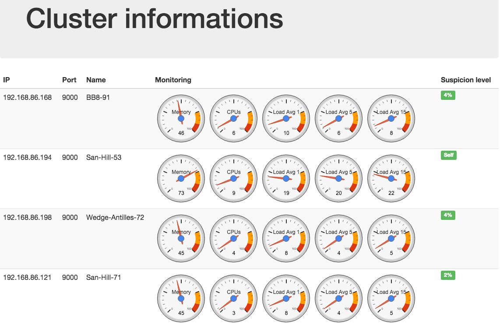

# PaaS Cluster of Raspberry Pi's

The idea here is to provide a minimum configuration to set up on several RPi's allowing them to **find each others over the network**, **communicate using a reliale gossip protocol** and **detect failures**. We can then deploy distributed systems without having to configure every node one by one. If you want to add a node to the cluster, just copy a configured SD card on a new one.
Most of the code is written in Javascript and runs with NodeJs.

Let's see the content of each main folder :

- `/gossip` : 
    - **advertisement** protocol runner (based on ZeroConf/Bonjour), used by the RPi's to find each others.
    - **gossip** protocol runner used to ensure a reliable communication between RPi's.
    - **accrual failure detector** using gossip, both are based on [Node-Gossip](https://github.com/bpot/node-gossip) : "based off of academic papers and Cassandra's (http://www.cassandra.org/) implementation of those papers". 

- `/visualisation` : contains a http server used by each node to display a webpage on port 8080 containing the following informations about the nodes : name, IP address, port and suspicion rate (Phi factor / threshold)

- `/monitoring` : sends monitored informations (cpu, ram, load averages) to gossip and view.

- `/utils` : 
    - `/install/install.sh` : constains the installation shell script used to set up the first SD card. You can then copy the image on other SD cards to get your cluster.
    - `/install/` : files required for the installation :                                         
        - `browser.js` is a little hack to get MDNS working well on Raspberry Pi (cf. [stackoverflow](http://stackoverflow.com/questions/29589543/raspberry-pi-mdns-getaddrinfo-3008-error))
        - `node-manager` is the service allowing to start, stop and restart the node-manager using `sudo service node-manager ...`
    - `/misc/shell_utils.sh` contains a couple of usefull commands
    
- `/conf` : contains a simple configuration file used by the node manager. 

- `/meta-data` : contains the meta-data manager used by the node manager to set and remove meta-data in the local file `~/meta-data.json` (on the node's filesystem).
    
- `/ansible` : 
    - full exemples of distributed deployement in `/playbook` (Nginx webservers and load balancer). The load balancer still has to its IPs hard coded. A simple templating engine may by added to improve deployement simplicity. 
    - a tool that uses a playbook file to generate an Ansible hosts file (`/etc/ansible/hosts`) from the list of Raspberry Pi's found over the network. Launched by `./generate_host_from_playbook.sh your_yml_playbook_file`.
    - a tool to easily change meta-data on a node. Exemple : `./meta-data add-service 192.168.86.121 nginx_webserver`
    - a tool to launch a service on several nodes at a time. It will automatically choose the less busy nodes and run the selected playbook on them. Services need to follow the convention used in `ansible/playbooks`. Exemple of use : `./launch 2 nginx_webserver`.
    - `/ansible/utils` is full of scripts used by the ones explained before.

The node manager starts running `/start_node.js`. By default the projet folder stays in `/home/pi` and is executed by the `node-manager` service **on start up**.
The cluster needs a DHCP service available on the network.